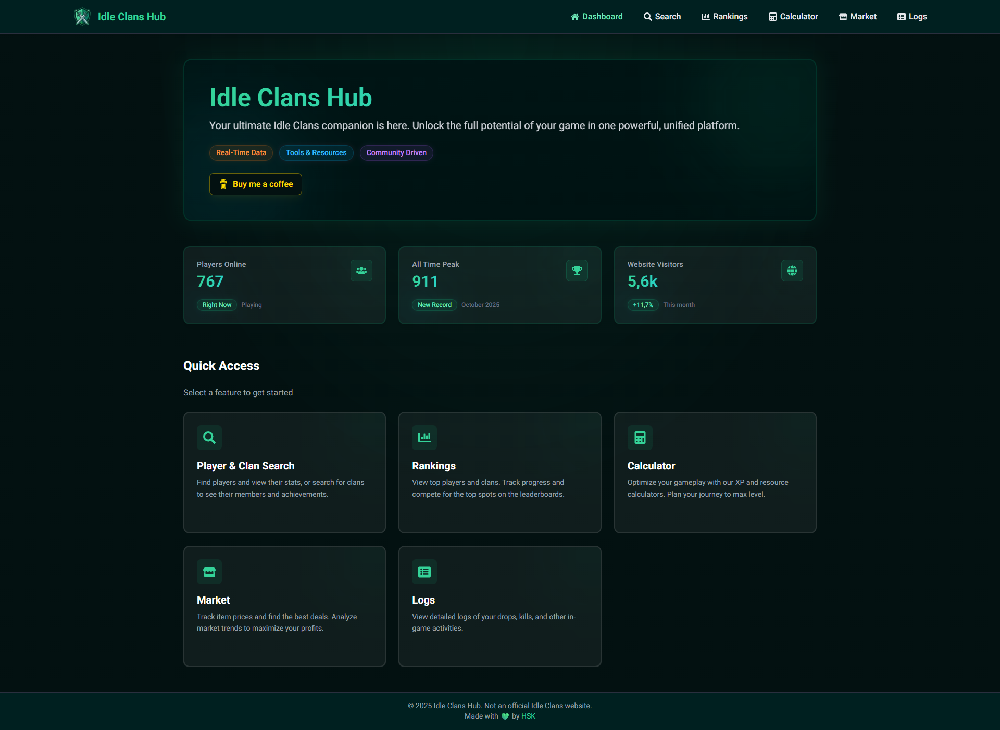
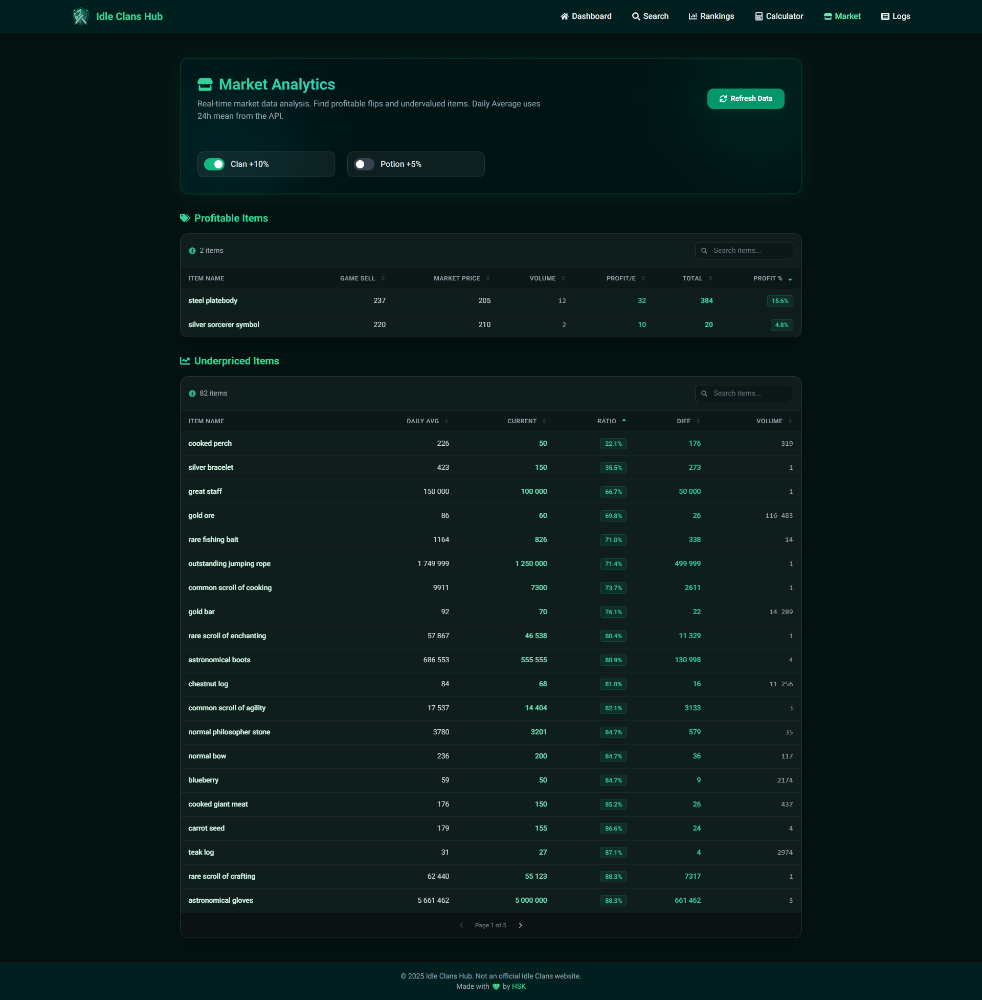
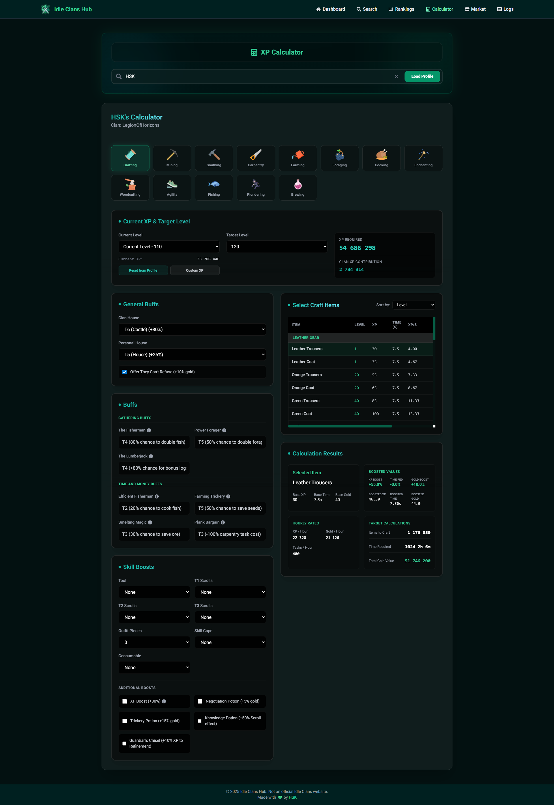
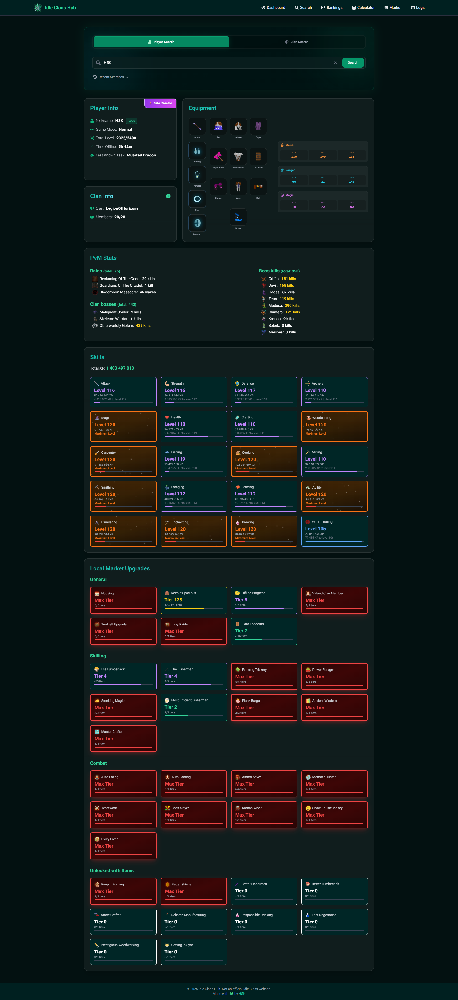
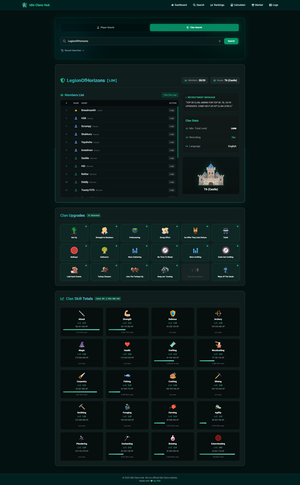

# 🎮 Idle Clans Hub

A powerful web application for searching and viewing detailed player statistics, skills, and local market upgrades for Idle Clans players. This tool helps you optimize your gameplay with advanced calculators, market analysis, and comprehensive player/clan data.

## 🛠️ Tech Stack

- **Framework**: [Next.js 15](https://nextjs.org/) (App Router)
- **Core**: [React 19](https://react.dev/)
- **Styling**: [Tailwind CSS](https://tailwindcss.com/)
- **State Management**: [Zustand](https://github.com/pmndrs/zustand)
- **HTTP Client**: [Axios](https://axios-http.com/)
- **Icons**: [React Icons](https://react-icons.github.io/react-icons/)
- **Tooltips**: [React Tooltip](https://react-tooltip.com/)

## ✨ Features

### 📊 Dashboard

Your central hub for game overview and quick stats.



### 💰 Market Analysis

Find the best deals and opportunities in the game.

- **Profit Finder**: Identifies items you can buy from players and sell to the game for immediate profit.
- **Market History**: Highlights underpriced items based on historical data.



### 🧮 XP Calculator

Plan your progression effectively.

- Calculate XP requirements for all skills.
- Accounts for boosts, upgrades, and clan bonuses.
- Accurate time estimates based on your current setup.



### 🔍 Player Search

Deep dive into player statistics.

- View detailed skill levels, experience, and tiers.
- Inspect equipment and enchantment boosts.
- Check PvM statistics (Bosses, Raids).
- View recent activity logs.



### 🛡️ Clan Search

Analyze clan performance.

- Detailed member lists and hierarchies.
- Clan upgrade progression.
- Aggregated skill statistics.



### 🚀 Additional Features

- **Smart Caching**: Data is cached for 5 minutes to ensure fast navigation and reduced API load.
- **Logs Viewer**: Searchable history of player and clan activities.
- **Dark Mode**: Fully responsive dark theme for comfortable viewing.
- **Direct Integration**: Real-time data fetching from Idle Clans API.

## 🚀 Getting Started

1. Clone the repository:

```bash
git clone https://github.com/karolhas/idleclanshub.git
```

2. Install dependencies:

```bash
npm install
# or
yarn install
```

3. Run the development server:

```bash
npm run dev
# or
yarn dev
```

4. Open [http://localhost:3000](http://localhost:3000) with your browser to see the result.

## 💎 Future Enhancements

- 📈 **Ranking with filters** - Top 200 players leaderboard.
- 🪧 **Your Next Skill** - Recommendations for your next skill cape.
- **Profit Maker** - Advanced market crafting analysis.

## 🤝 Contributions

Contributions are welcome!

1. Fork the repository.
2. Create a feature branch (`git checkout -b feature/amazing-feature`).
3. Commit your changes (`git commit -m 'Add some amazing feature'`).
4. Push to the branch (`git push origin feature/amazing-feature`).
5. Open a Pull Request.

## 📝 License

This project is licensed under the MIT License. See the [LICENSE](LICENSE) file for details.

## 🤝 Connect with Me

- **Email**: [karolhas.kontakt@gmail.com](mailto:karolhas.kontakt@gmail.com)
- **LinkedIn**: [Karol Has](https://www.linkedin.com/in/karolhas/)
- **Twitter**: [@hskdaking](https://x.com/hskdaking)

---

Built with ❤️ for the Idle Clans community
